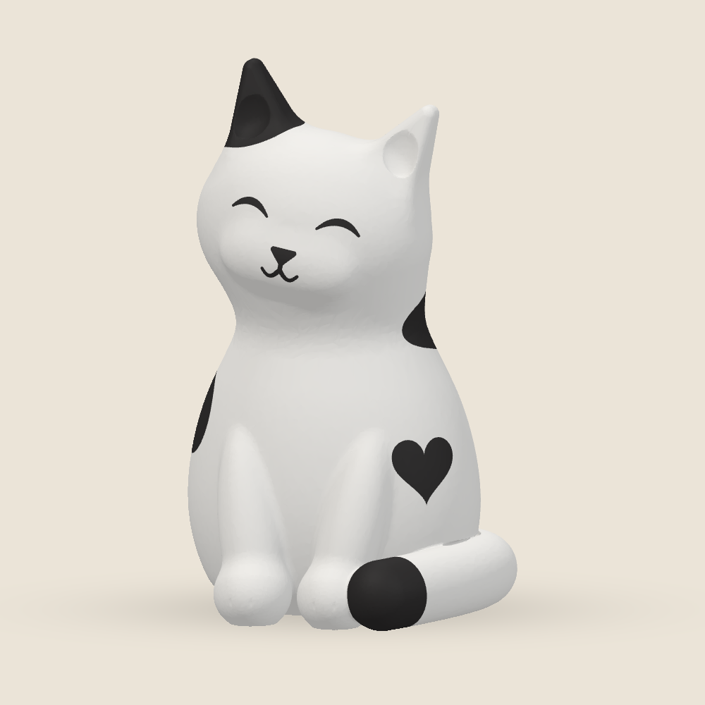
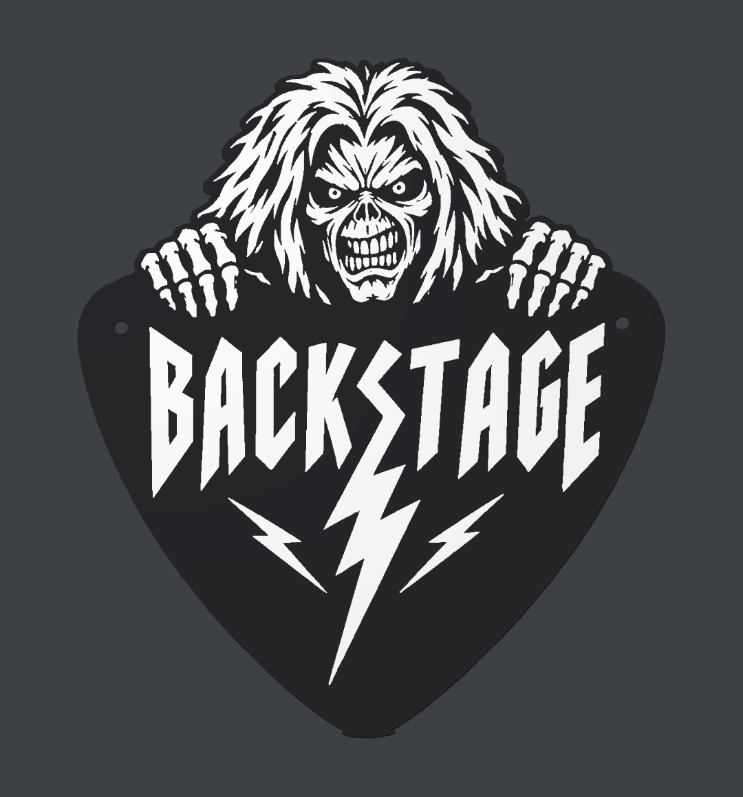
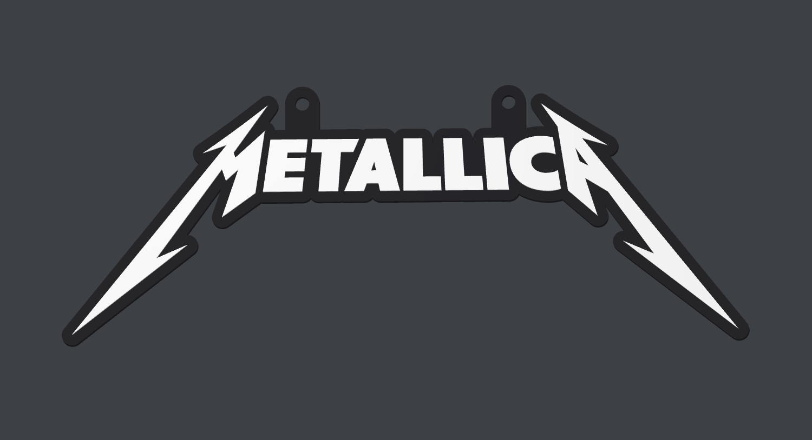

# Levi · 3D Printables

Original designs and unofficial music fan art for personal 3D printing.

**[Browse the models](#the-collection) · [Download the collection](https://github.com/Cyberlevi/levi-3d-printables/archive/refs/heads/main.zip) · [Magyar útmutató](docs/README.hu.md) · [Share print feedback](https://github.com/Cyberlevi/levi-3d-printables/issues/new/choose)**

STL parts, geometry-only 3MF assemblies and practical print notes. Editable design sources are included for the original models; fan-art models are supplied as meshes. Check each model's terms before use.

> **Experimental collection · v0.3.0**
> These files have digital geometry checks; successful completed physical prints remain unverified. The Spotted Cat's first PLA print was in progress at publication on 8 October 2026. All preview images are CAD renders, not photographs of printed objects.

## The collection

<table>
<tr>
<td width="50%"><a href="models/spotted-cat"></a></td>
<td width="50%"><b><a href="models/spotted-cat">Spotted Cat · Pöttyös cica</a></b><br>Original design · CC BY-NC-SA 4.0<br>A gently smiling cat with plump paws, a wrapped tail and a heart-shaped spot.<br>84.01 × 88.31 × 140 mm · black and white PLA<br>Economy setup: 104 g / 6 h 56 min estimated<br>First print in progress at publication; completion unverified.<br><a href="models/spotted-cat/files/spotted-cat.3mf">Download 3MF</a> · <a href="models/spotted-cat">Print guide and STL files</a></td>
</tr>
<tr>
<td width="50%"><a href="fan-art/eddie-backstage"></a></td>
<td width="50%"><a href="fan-art/metallica-wall-sign"></a></td>
</tr>
<tr>
<td><b><a href="fan-art/eddie-backstage">Eddie · BACKSTAGE</a></b><br>Unofficial fan art · personal self-printing terms<br>213.759 × 249.970 × 3.6 mm · two mounting holes<br><a href="fan-art/eddie-backstage/files/eddie-backstage.3mf">Download 3MF</a></td>
<td><b><a href="fan-art/metallica-wall-sign">Metallica · Wall Sign</a></b><br>Unofficial fan art · personal self-printing terms<br>200 × 75.446 × 4 mm · two mounting holes<br><a href="fan-art/metallica-wall-sign/files/metallica-wall-sign.3mf">Download 3MF</a></td>
</tr>
<tr>
<td width="50%"><a href="models/backstage-pick"></a></td>
<td width="50%"><a href="models/long-neck-dino-keyring"></a></td>
</tr>
<tr>
<td><b><a href="models/backstage-pick">BACKSTAGE · Lightning Pick</a></b><br>Original design · CC BY-NC-SA 4.0<br>A large, two-colour door or wall sign.<br>240 × 250 × 4.2 mm · two mounting holes</td>
<td><b><a href="models/long-neck-dino-keyring">Long-Neck Dino · Keyring</a></b><br>Original design · CC BY-NC-SA 4.0<br>A small sculpted companion with an integrated loop.<br>19.69 × 49.64 × 50 mm · three colour parts</td>
</tr>
</table>

The fan-art models use third-party character or logo imagery. They are not official products, and we do not claim ownership of that imagery. Their [personal printing terms](fan-art/TERMS.md) cover only rights in our own contributions.

## Start printing

1. Open a model page and read its terms, orientation and support notes.
2. Download its **3MF assembly** or STL parts. A 3MF here contains geometry and display colours; it is not a sliced print job or a printer preset.
3. Select your printer, nozzle and filament in your own slicer. Check bed fit, supports, colour assignments and the layer preview before printing.
4. Share a photo and your settings through [Print feedback](https://github.com/Cyberlevi/levi-3d-printables/issues/new/choose). That helps turn a digitally checked design into a documented, physically tested model.

STL files use millimetres and do not store colours. Import colour parts together as one assembly and preserve their shared coordinates. Some slicers ignore 3MF display colours: assign the parts manually when needed. No machine-specific G-code is distributed.

## What's included

Each model folder contains `files/`, `images/`, a print guide and `validation.json`. The three original models in `models/` also include editable `source/`; the two fan-art models in `fan-art/` are mesh-only releases. The [catalog](catalog.json) records dimensions, terms and test status; [SHA256SUMS](SHA256SUMS) lets you verify the files. Changes are recorded in the [changelog](CHANGELOG.md).

**Design provenance:** modeling and print preparation by Levi / [Cyberlevi](https://github.com/Cyberlevi), with AI assistance. The original BACKSTAGE lightning sign uses a pick/lightning layout and DejaVu lettering; the dinosaur and spotted cat are procedural geometry. The Eddie sign was traced from an AI-generated concept selected by the maintainer. The Metallica sign was traced from an SVG on Metallica's official website. Eddie and the Metallica logo are not our original characters or artwork. See [provenance](docs/PROVENANCE.md) for the sources and checks.

## License

**Original models in `models/`: [CC BY-NC-SA 4.0](https://creativecommons.org/licenses/by-nc-sa/4.0/).** Their existing license remains unchanged. Credit Levi / Cyberlevi and this repository, identify your changes, use the material noncommercially, and share distributed adaptations under the same license.

**Fan-art files in `fan-art/`: [personal printing terms](fan-art/TERMS.md).** To the extent we hold rights in our contributions, these terms allow you to download, prepare and print the files yourself for personal, noncommercial use. No sale of files or prints, paid printing or other commercial use is licensed. Third-party rights remain with their respective holders; personal or noncommercial use does not by itself resolve those rights. These files are not offered under the original models' CC license.

Reusable validation/export tooling in `tools/` has the [MIT license](licenses/MIT.txt). Collection documentation remains CC BY-NC-SA 4.0, excluding third-party material and the separate terms for `fan-art/`. See [LICENSE](LICENSE) for exact scope.

Suggested credit for the original models: **“Levi / Cyberlevi — Levi 3D Printables, CC BY-NC-SA 4.0”**, with a link to this repository and a note describing any changes. Fan-art credit: **“Unofficial fan-made 3D adaptation; modeling and print preparation by Levi / Cyberlevi, with AI assistance. Underlying character and logo imagery belongs to its respective rights holders.”**

## Support the collection

A star, a useful print report or a well-documented improvement helps this collection grow. Suggestions and photos are welcome in [Issues](https://github.com/Cyberlevi/levi-3d-printables/issues). Please read the short [contribution guide](CONTRIBUTING.md).

### Optional Bitcoin support

If you would like to support future designs, you can send **Bitcoin (BTC) on the Bitcoin main network** to this receiving address:

```text
bc1qnnfgdm6a9zn8e640lkh3uarr99fkntf6dh7q3c
```


[Download the QR code](docs/images/bitcoin-support-qr.png). Contributions are voluntary; the model downloads remain free for noncommercial use under the stated license.
