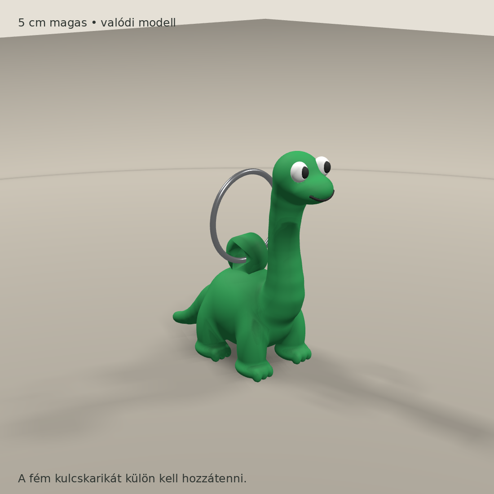

# Levi · 3D Printables

Small original designs for music rooms, keys and everyday making.

**[Browse the models](#the-collection) · [Download the collection](https://github.com/Cyberlevi/levi-3d-printables/archive/refs/heads/main.zip) · [Magyar útmutató](docs/README.hu.md) · [Share print feedback](https://github.com/Cyberlevi/levi-3d-printables/issues/new/choose)**

STL parts, geometry-only 3MF assemblies, editable design sources and practical print notes — free for noncommercial use.

> **Experimental collection · v0.1.0**
> These files have digital geometry checks, but neither model has a verified successful physical print yet. All preview images are CAD renders, not photographs of printed objects.

## The collection

<table>
<tr>
<td width="50%"></td>
<td width="50%"></td>
</tr>
<tr>
<td><b><a href="models/backstage-pick">BACKSTAGE · Lightning Pick</a></b> A large, two-colour door or wall sign. 240 × 250 × 4.2 mm · two mounting holes</td>
<td><b><a href="models/long-neck-dino-keyring">Long-Neck Dino · Keyring</a></b> A small sculpted companion with an integrated loop. 19.69 × 49.64 × 50 mm · three colour parts</td>
</tr>
</table>

## Start printing

1. Open a model page and read its orientation and support notes.
2. Download its **3MF assembly** or STL parts. A 3MF here contains geometry and display colours; it is not a sliced print job or a printer preset.
3. Select your printer, nozzle and filament in your own slicer. Check bed fit, supports, colour assignments and the layer preview before printing.
4. Share a photo and your settings through [Print feedback](https://github.com/Cyberlevi/levi-3d-printables/issues/new/choose). That helps turn a digitally checked design into a documented, physically tested model.

STL files use millimetres and do not store colours. Import colour parts together as one assembly and preserve their shared coordinates. Some slicers ignore 3MF display colours: assign the parts manually when needed. No machine-specific G-code is distributed.

## What's included

Each model folder contains `files/`, `images/`, editable `source/`, a print guide and `validation.json`. The [catalog](catalog.json) records dimensions and test status; [SHA256SUMS](SHA256SUMS) lets you verify the files. Changes are recorded in the [changelog](CHANGELOG.md).

**Design provenance:** developed by Levi / [Cyberlevi](https://github.com/Cyberlevi) with AI assistance for modeling code, design iteration and documentation. The BACKSTAGE sign uses an original pick/lightning layout and DejaVu lettering. The dinosaur is procedural geometry. See [provenance](docs/PROVENANCE.md) for the sources and checks. No third-party band mascot or band logo is included in this collection.

## License

Model assets, model-specific source, renders and documentation: **[CC BY-NC-SA 4.0](https://creativecommons.org/licenses/by-nc-sa/4.0/)**. Credit Levi / Cyberlevi and this repository, identify your changes, use the material noncommercially, and share distributed adaptations under the same license. These terms apply to rights the contributor can grant; they do not create new rights over third-party material.

Reusable validation/export tooling in `tools/` has the [MIT license](licenses/MIT.txt). See [LICENSE](LICENSE) for exact scope. This is a source-available model collection for noncommercial use.

Suggested credit: **“Levi / Cyberlevi — Levi 3D Printables, CC BY-NC-SA 4.0”**, with a link to this repository and a note describing any changes.

## Support the collection

A star, a useful print report or a well-documented improvement helps this collection grow. Suggestions and photos are welcome in [Issues](https://github.com/Cyberlevi/levi-3d-printables/issues). Please read the short [contribution guide](CONTRIBUTING.md).
